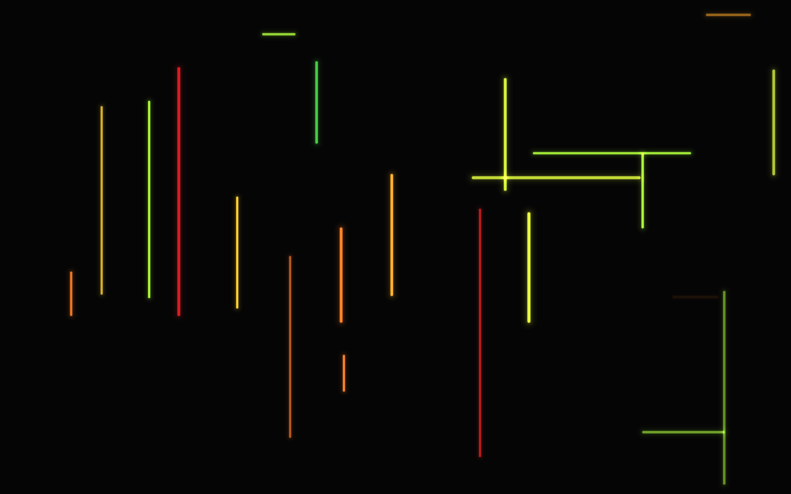
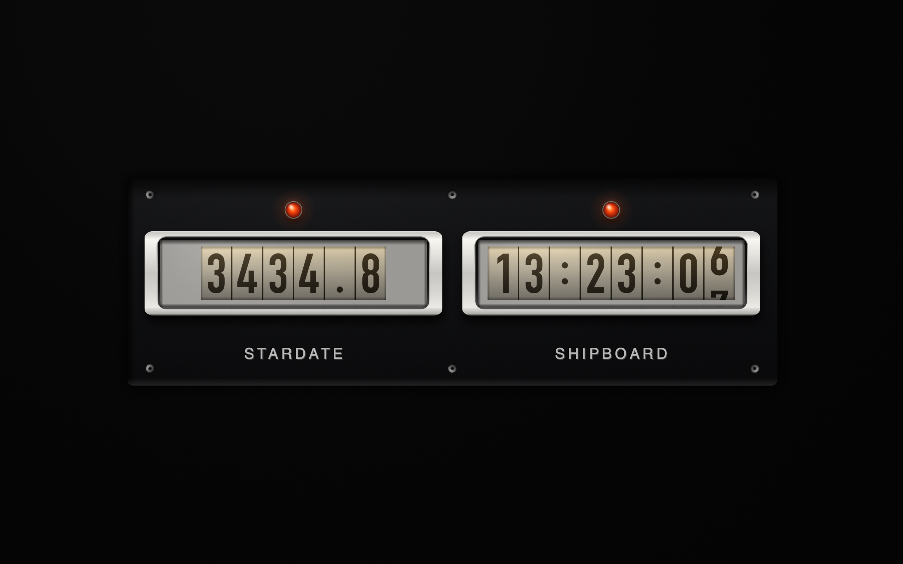
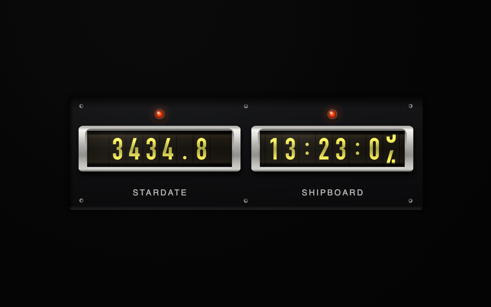
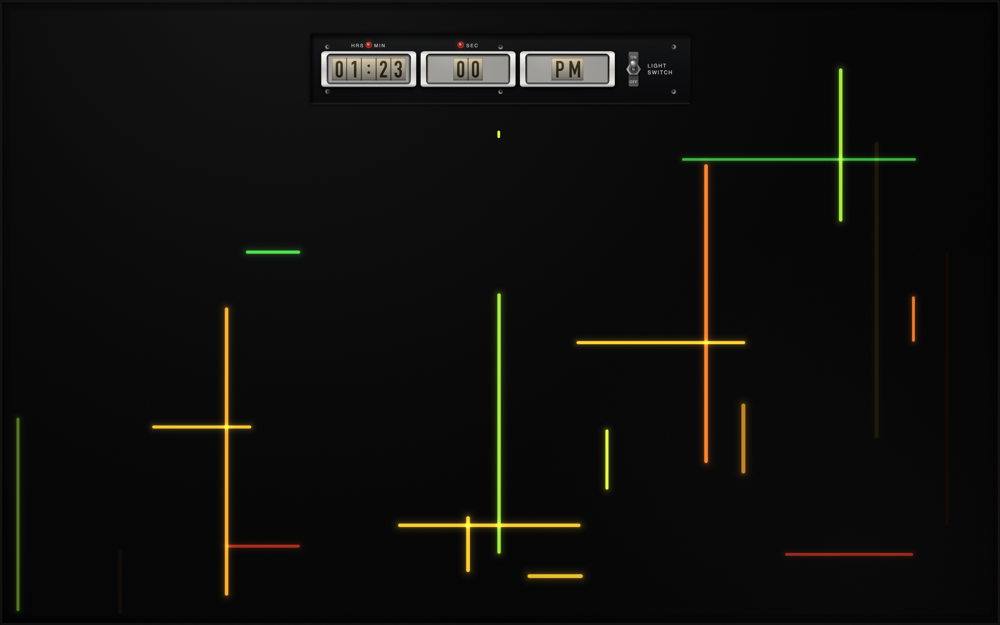
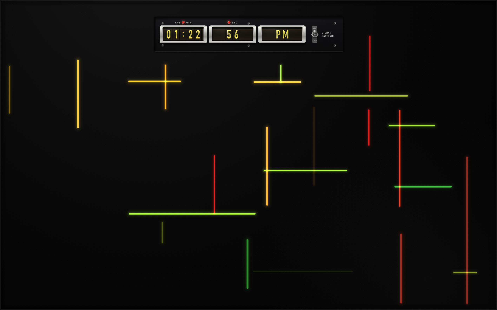

# Star Trek TOS screensavers

Five macOS screensavers built from set props in *Star Trek: The Original
Series*. All are original code and original artwork; only the look is
referenced.

| Screensaver | What it shows |
|---|---|
| **M-5 Multitronic** | the M-5 computer readout field |
| **TOS Chronometer — Remaster** | stardate and ship's time, remastered finish |
| **TOS Chronometer — Classic** | the same panel as the original prop |
| **M-5 Multitronic with Clock — Remaster** | the field with a clock module |
| **M-5 Multitronic with Clock — Classic** | the same, original-prop finish |



## Two eras of the same prop

The chronometer appears twice on screen in the series, and the remastered
episodes rebuilt it. The two are not a recolour of each other — they are
different mechanisms, and the code treats them that way through
`CounterWindow.finish`.

**Classic** is a mechanical drum counter: dark ink printed on pale wheels
behind a white mask, lit by a warm lamp above the opening. The wheels are
*reflective*, so a digit change physically rotates — the numerals travel on an
arc, vertical position following sin and apparent height following cos, and the
foreshortening is what reads as rotation rather than a card sliding past.



**Remaster** is an emissive readout: lit amber numerals on dark drums. There is
no wheel to turn and no lamp to switch, so digits translate rather than rotate,
and the clock module drops the light switch entirely.



The shading runs opposite ways for the same reason. The dark drum is lit from
the slot edges, brightest top and bottom. The pale drum has no lamp of its own
— light enters from behind the mask, strongest along the top — so it darkens
towards the bottom, and the shading multiplies over the numerals because they
are printed on that surface rather than glowing through it.

## The clock module

A black anodised aluminium insert sunk into the gloss display, with `HRS`,
`MIN` and `SEC` engraved and ink-filled. Three drums — hours and minutes,
seconds, meridiem — sharing one digit pitch and one glyph height so the
sections cannot disagree on size. Every character rides its own wheel, and the
wheels are the same width, so the punctuation gets a full cell.

| | |
|---|---|
|  |  |
| Classic | Remaster |

## References

The proportions, palette and lighting here were measured off two sources
rather than guessed. Neither is reproduced in this repository — they belong to
their rights holders — so they are cited instead:

- **The original prop**, a countdown panel: two windows of dark numerals on
  pale drums, red indicator lamps captioned `HRS`/`MIN` and `SEC`, and two bat
  toggles labelled *light switch* and *clock switch* below.
- **The remastered chronometer**, seen at about 0:46 of
  [this clip](https://www.youtube.com/watch?v=wGB9gjRnv00): amber numerals on
  gloss black behind chrome bezels, captioned `STARDATE` and `SHIPBOARD`.
- **The M-5 readout field**, at about 0:39 of
  [this clip](https://www.youtube.com/watch?v=8ixabejG0O0) — "The Ultimate
  Computer", S2E24.

What was taken from them: the bar palette (lime through deep red, plus a rare
teal — 1960s Technicolor pushes the greens yellow and the reds orange); the
window proportions and the frame being wider at the sides than top and bottom;
the lamp placement inline with the captions rather than one per window; and the
fact that the numerals carry a visible vertical falloff from the lamps.

## Install

Requires Xcode for the current SDK.

```bash
./build.sh && cp -R build/*.saver ~/"Library/Screen Savers/"
```

Then pick one in System Settings → Screen Saver, under Other. Run the same line
again to reinstall; if a saver is already selected, `killall legacyScreenSaver`
afterwards so macOS drops the cached bundle.

Builds universal (x86_64 + arm64) against the macOS 15 SDK.

**Thumbnails are not possible.** Apple provides no supported way to replace the
default screensaver thumbnail — confirmed by Apple DTS on the
[developer forums](https://developer.apple.com/forums/thread/806641) — and on
macOS 26 custom thumbnails do not display at all.

## Fonts

`DigitFacePreference` resolves DIN Condensed Bold → SF Condensed Bold → the
built-in drum vectors in `src/DrumDigits.swift`. Everything in that chain ships
with macOS, so nothing needs installing and no font is bundled.

**Never request SF by PostScript name.** CoreText silently substitutes Times
New Roman for `.SFNS-Bold` and only logs a note about it. Use
`NSFont.systemFont` with a descriptor width trait.

## The framework does not stop your saver

Apple's screen saver framework does not reliably tear a view down when the
saver is dismissed. The instance survives and `animateOneFrame` keeps being
called, burning CPU with nothing on screen. Every view here tracks its own
state through `startAnimation` / `stopAnimation` and `viewDidMoveToWindow`.

Measured on the animation callback: 17.8 µs running against 0.09 µs dismissed
on the bar field, and 140.7 µs against 0.17 µs on the retro clock. Without the
guard, that second figure runs forever.

## What actually costs time

Measured at 2560×1600 on a 1.4 GHz Core i5-8257U, against a 16.67 ms budget.

The single biggest cost by a wide margin is a **full-screen radial gradient**.
One as a vignette measured ~72 ms/frame alone. Later the gloss backdrop and the
cover glass reintroduced three of them between them, and the clock saver ran at
**341 ms/frame**. Both layers are fixed for a given size, so they are rendered
once and blitted, taking that saver to ~22 ms. If something is suddenly slow,
look for a gradient covering the whole screen before anything else.

Caching that pays: whole static layers as `CGImage` — the backdrop, the glass,
screw heads, the toggle. Caching that did not: the same trick via `CGLayer`,
and per-window bezels; both measured inside noise. Rectangular clipping instead
of rounded-path clipping was worth about 1.5 ms.

Benchmarks are meaningless on a loaded machine. Check `uptime` first — a
background encode moved these numbers by 7×.

## A note on derived dimensions

Nearly every visual defect in this project has had the same cause: a dimension
written as its own constant when it should have been derived from the thing it
must fit. Bezel width, aperture radius, label spacing, the mask opening, roll
travel, glyph height across windows — each was two numbers that had to agree,
written separately, until one changed.

They are consolidated now: `bezelWidth` and `bezelSideWidth`, `apertureRadius`,
`labelWidth` for measuring text, mask opening from the drawn glyph height, roll
travel from aperture height. If something looks wrong, look first for two values
that must match but are stated independently.

## Licence

MIT — see [LICENSE](LICENSE). Star Trek is a trademark of CBS Studios Inc.;
this is unaffiliated fan work and ships no material from the series.
