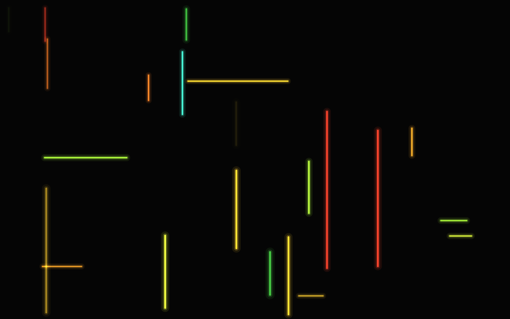
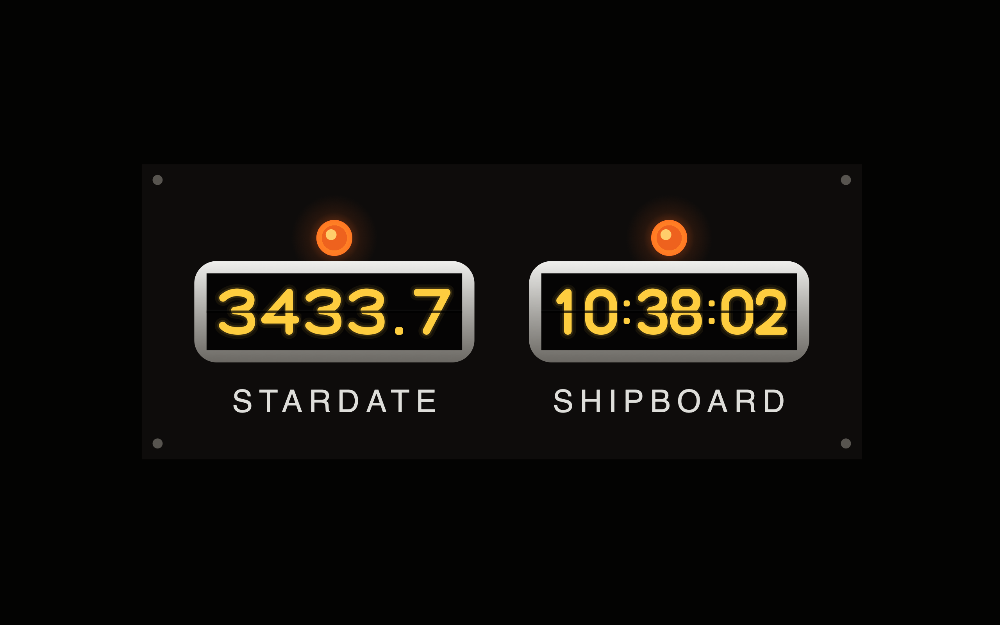
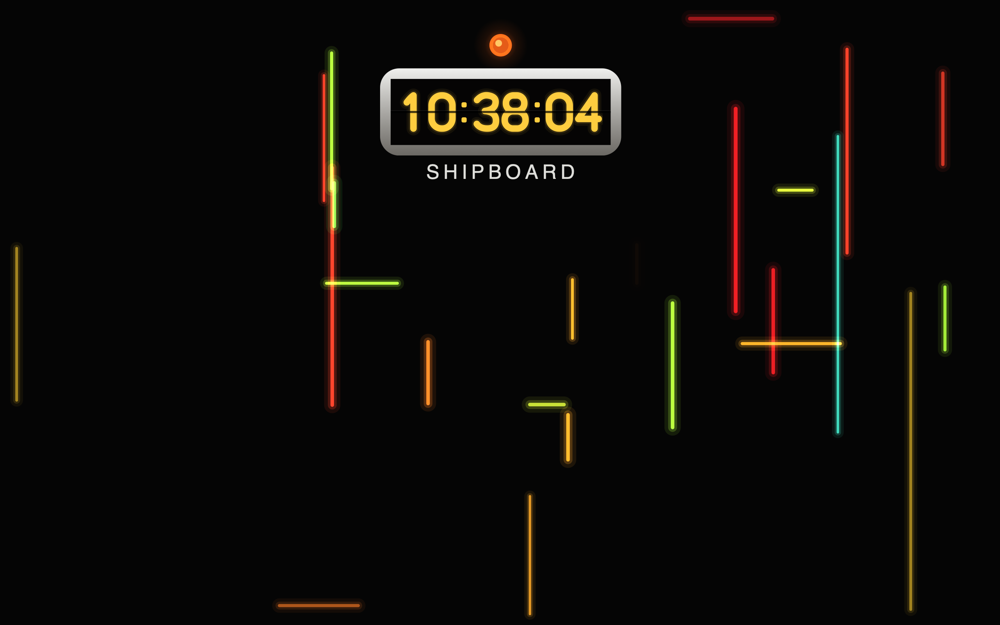

# Star Trek TOS screensavers

Three macOS screensavers built from set props in the original series. All are
original code; only the look is referenced.

- **M-5 Multitronic** — the M-5 computer readout panel
- **TOS Chronometer** — the stardate chronometer
- **M-5 Multitronic with Clock** — the panel with the shipboard clock along the top

---

## M-5 Multitronic

A macOS screensaver based on the M-5 computer readout panel from *Star Trek*
TOS, "The Ultimate Computer" (S2E24) — the black panel of short coloured light
bars that blink, extend and retract while the machine thinks.

### What it does

Bars sit on a jittered grid over a black field. Each one grows from an anchor
point (some ease in, ~25% snap on instantly), holds for 1.2–6.5s — sometimes
with a hard stutter, sometimes with a slow breathing pulse — then either
retracts, fades, or cuts out. After a dark gap it respawns somewhere else in a
new colour. About 72% are upright, the rest horizontal, matching the prop; the
uprights run 40% longer. A bar grows towards whichever side has room, so long
strokes aren't clipped back into stubs when they spawn near an edge.

Palette sampled from the episode: lime, yellow-green, green, amber, gold,
orange, red-orange, deep red, and an occasional teal. The 1960s Technicolor
push means the greens sit yellow and the reds sit orange.

Each bar is drawn in three additive passes — a wide dim bloom, a tighter halo,
and the saturated core — with the bloom pulled in on short bars so stubs read
as strokes rather than glowing dots. A per-bar edge falloff stands in for a
CRT vignette.



### Knobs

All in `src/M5PanelView.swift`:

| What | Where |
|---|---|
| Colours and their relative frequency | `kPalette` |
| How many bars are alive at once | `want = (_cols * _rows) * 0.060` in `buildLayoutForSize:` |
| Grid coarseness | `_cellH` in `buildLayoutForSize:` |
| Bar thickness | `_unit` in `buildLayoutForSize:` |
| Length distribution (stub / medium / long) | the `roll` block in `respawnBar:` |
| Timing — grow, hold, leave, gap | the `frange(...)` durations in `respawnBar:` |
| Stutter / pulse frequency | `flickers`, `breathes`, `modRate` in `respawnBar:` |
| Glow strength and spread | `widthMul` / `alphaMul` in `drawRect:` |
| Vertical vs horizontal mix | `bar->vertical = (frand() < 0.72)` |

### Performance

CPU rasterisation of `drawRect:` at 2560×1600 runs roughly 9–15 ms/frame on a
1.4 GHz Core i5-8257U, varying with thermal state and with how much of the
field happens to be lit — the content is random, so no two runs draw the same
area. Swift and the original Objective-C measured within run-to-run noise of
each other over interleaved 400-frame runs; the port was a maintainability
change, not an optimisation.

The first version composited a full-screen radial gradient for the vignette,
which cost ~72 ms/frame at 2560×1600 on its own. Baking the falloff into each
bar's alpha at spawn time gives the same look for free.

Cost scales with lit area, so it's the long bars and the width of the outer
bloom (`widthMul[0]`) that dominate — lengthen the bars much further and that
is the first thing to trim.

The three strokes that make up a bar used to be drawn as three passes over the
whole array, so that the core landed on top. `plusLighter` is saturating
addition and therefore order-independent, so they are now emitted in one visit
per bar — same pixels, a third of the per-bar state evaluation.

---

## TOS Chronometer

A dark panel carrying two chrome-bezelled windows of amber drum-counter digits,
an indicator lamp over each, and letterspaced labels beneath. The left window
shows a stardate, the right a 24-hour shipboard clock. Panel proportions,
window sizes, lamp placement and label position are all measured off the prop.

The digits are **not a font**. The prop uses a mechanical drum counter, so the
ten numerals plus the colon are stroked vector paths in `src/DrumDigits.swift`,
built on a unit box and sized by a single stroke-weight fraction. Each digit
carries the horizontal seam where the two halves of the wheel meet, and when a
digit changes the old one rises out of view while the new one comes up from
below, clipped by the window.

The labels use Helvetica, which ships with macOS. The prop's labels are a
letterspaced neo-grotesque — consistent with Helvetica, though the broadcast
source is too soft to identify it definitively. Nothing is bundled, so there is
no font-licensing question.

The whole panel drifts slowly on two incommensurate periods, so a clock left on
screen for hours isn't a burn-in risk.



### Stardate

Stardates aren't canon, so `Stardate` in `src/ChronometerView.swift` states an
explicit convention: 1000.0 on 2020-01-01, advancing 1.0 per day, which puts
the present in the 3000s — the range TOS actually used. Change `epochValue`,
`perDay` and `epochDate` to re-base it.

### Knobs

| What | Where |
|---|---|
| Digit, lamp and label colours | `Style` in `ChronometerView.swift` |
| Glow strength and spread | `Style.bloom` |
| Roll speed | `rollDuration` |
| Panel and window proportions | `draw(_:)` — fractions are measured off the prop |
| Digit letterforms | `DrumDigits.path(_:in:)` |
| Stroke weight | `DrumDigits.strokeFraction` |
| Drift rate and amount | the `amp` / `drift` block in `draw(_:)` |

### Performance

At 2560×1600 on a 1.4 GHz Core i5-8257U, against a 16.6 ms budget at 60fps:
M-5 panel 3.7 ms, chronometer 7.9 ms, panel with clock 6.9 ms.

---

## M-5 Multitronic with Clock

The bar field with the chronometer's shipboard clock along the top: lamp,
bezelled window, letterspaced label.

`M5ClockView` subclasses `M5PanelView` rather than duplicating the field, and
the counter window is shared with the chronometer through `CounterWindow`. The
clock reserves the strip it occupies via `reservedRegion`, so bars neither
spawn inside it nor grow across it — the field leaves room instead of running
underneath. The reserved rect covers the clock's full drift range, so it stays
correct wherever the drift puts it, and it is computed from `bounds` alone
because it is consulted during `init`.

The clock drifts too, but by a third as much as the chronometer's, since it is
already close to a screen edge.



To make the clock bigger, smaller, or lower, edit `layout(offsetBy:)` in
`src/M5ClockView.swift`; the reserved region follows automatically.

---

## Install

```bash
./build.sh && cp -R build/*.saver ~/"Library/Screen Savers/"
```

Then pick either in System Settings → Screen Saver, under Other. Run the same
line again to reinstall after editing. If a screensaver is already selected,
`killall legacyScreenSaver` afterwards so macOS drops the cached bundle.

To remove, delete the matching bundles from `~/Library/Screen Savers/`.

## Notes

`build.sh` builds for the host architecture. Screensaver bundles must match the architecture of the host process, and
Rosetta does not apply — an Intel `.saver` will not load into the arm64
`legacyScreenSaver` on Apple Silicon, it just won't show up in the list.

Moving to an Apple Silicon Mac: copy this folder over, install the Command Line
Tools (`xcode-select --install`) if they aren't there, and run `./build.sh`.
It detects `arm64` and sets the deployment floor to 11.0 automatically.

## A Swift 5.2 landmine

Written in Swift, built with `swiftc` from the Command Line Tools. One trap is
worth recording: a **file-scope `let` with a non-trivial initialiser crashes on
first access** once the bundle is `dlopen`'d by the screensaver host, when a
Swift 5.2 compiler is paired with a much newer Swift runtime. The lazy
initialisation accessor the old compiler emits does not survive the trip. It
reproduces at every optimisation level, including `-Onone`, and lands as a
SIGSEGV inside whatever happens to touch the global first — which makes it look
like a bug anywhere but where it is.

The same data declared as `static let` on a type is fine, so `Palette` is an
enum namespace rather than a pair of globals. This should not bite on a modern
toolchain, but the type-scoped form costs nothing and is portable.

The animation is original code; only the look is referenced. Star Trek is a
trademark of CBS Studios Inc.; this project is unaffiliated fan work and ships
no material from the show.

## License

MIT — see [LICENSE](LICENSE).
